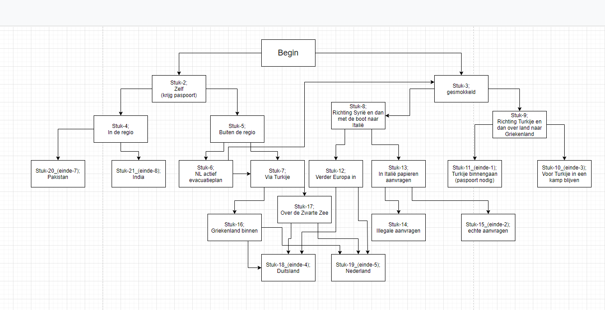

<h1 style="color:rgb(255,77,77);">Deze opdracht is af!</h1>

# Beroepsopdracht: Hello You!

Dit is de eerste beroepsopdracht die ik op het Mediacollege Amsterdam  
Bij de opleiding Software development gekregen heb. Het is een  
verhaal over een nieuwkomer in Nederland. Dit is gebaseerd op allerlei  
verhalen die ik gelezen en gehoord heb. Hiervan heb ik een textbased  
applicatie in _Python_ gemaakt om het verhaal ook door andere  
te laten beleven. Door verschillende keuzes in het verhaal te  
maken, zullen er verschillende verhaallijnen komen die ook tot een  
ander einde zullen leiden.

Het bestand waar de opdracht om ging is: [main.py](./main.py).  
Voor een server version waar een andere client verbind: [/Server-version](./Server-version).  
Voor een server version waar je met een browser verbind: [/Server-html](./Server-html).  
  
Mijn [verhaal](./Verhaal.md)  
Mijn [flowchart](./flowchart.png):  
